#  Automated Subject Allocation and Workload Calculation

##  Project Overview
This project automates the process of **subject allocation and workload distribution** for college faculty, ensuring a fair and efficient system.  
It assigns subjects based on **faculty preferences, qualifications, and department requirements**, minimizing manual effort and improving transparency.

---

##  Key Features
-  Automated subject allocation based on teacher preferences and qualifications  
-  Workload calculation ensuring equitable distribution among faculty  
-  Iterative top-down and bottom-up approach for balanced assignments  
-  Admin dashboard to manage faculty, subjects, and allocations  
-  Reports and summaries for departmental insights  

---

##  Technologies Used
- Frontend: HTML, CSS, JavaScript  
- Backend: PHP  
- Database: MySQL (phpMyAdmin)  
- Data Handling: Excel  

---

##  Installation & Setup

1. Clone this repository  
   git clone https://github.com/yourusername/automated-subject-allocation.git  

2. Move the project to your local server directory  
   C:/xampp/htdocs/automated-subject-allocation  

3. Import the database  
   - Open phpMyAdmin  
   - Create a new database (e.g., subject_allocation_db)  
   - Import the SQL file located at sql/database_schema.sql  

4. Configure the database connection  
   Edit config/config.php with your database credentials:  
   <?php $servername = "localhost"; $username = "root"; $password = ""; $dbname = "subject_allocation_db"; ?>
   
5. Run the project  
Visit: http://localhost/automated-subject-allocation/  

---

##  Project Preview
 
Subject Allocation Home:
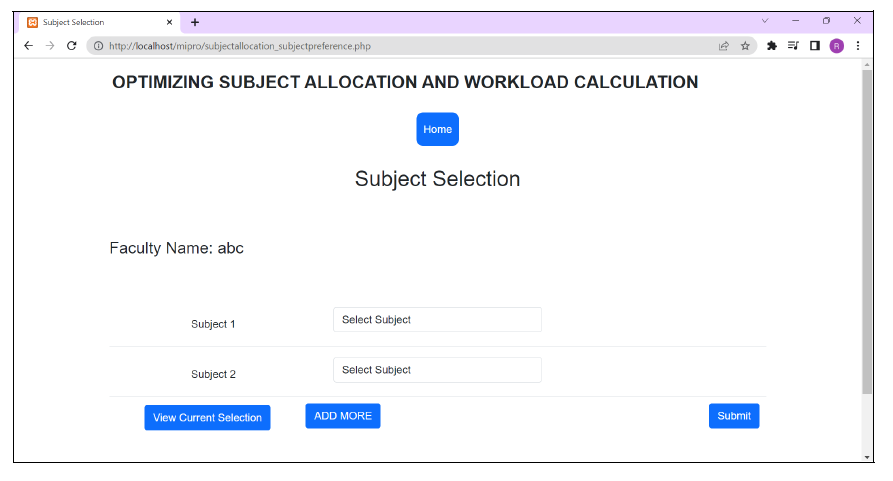  

Subject Allocation Menu:
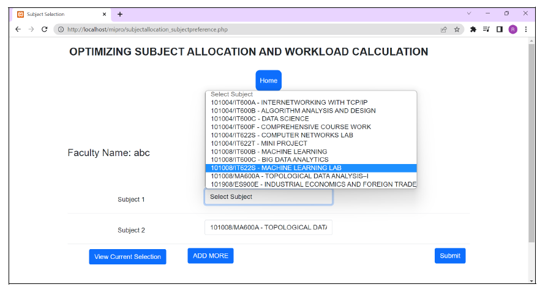  

Subject Allocation Selected Menu:
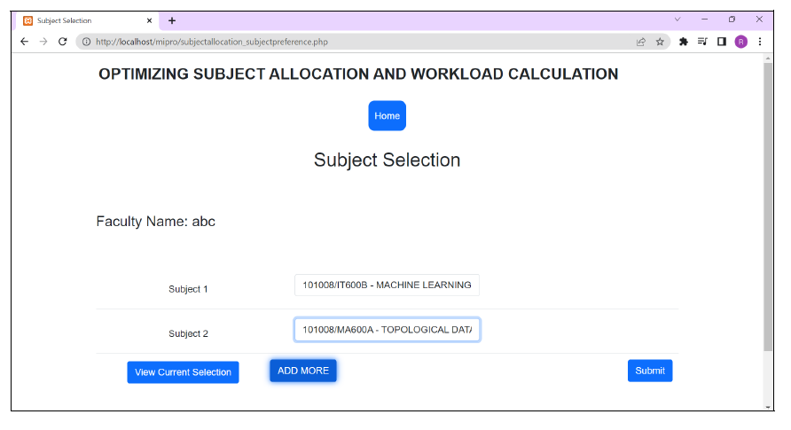  

Subject Allocation Add More Menu:
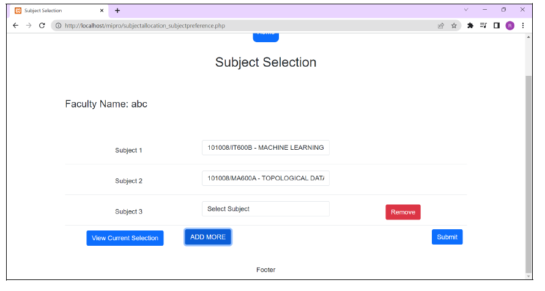  

Subject Allocation Edit Selection:
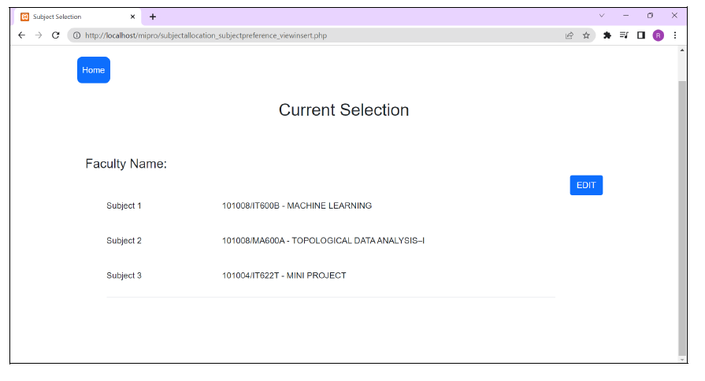  

Load Allocation Current Selection:
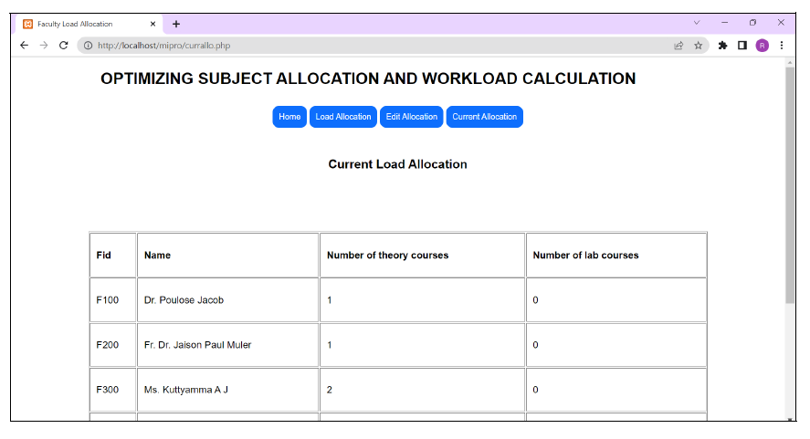  

Load Allocation Edit Name:
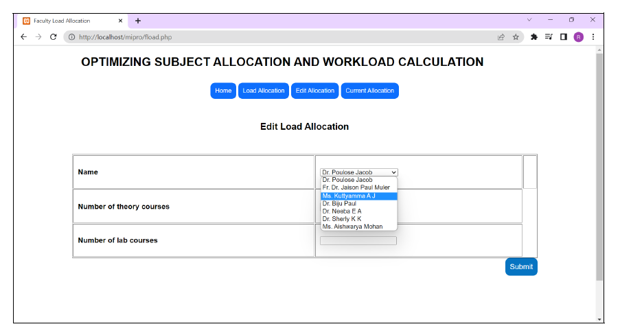  

Load Allocation Edit Course:
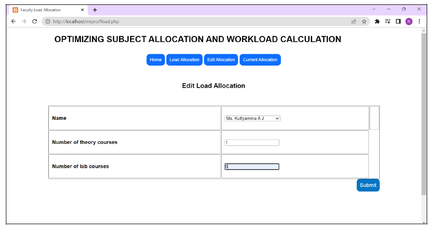  

Priority Allocation Current Allocation:
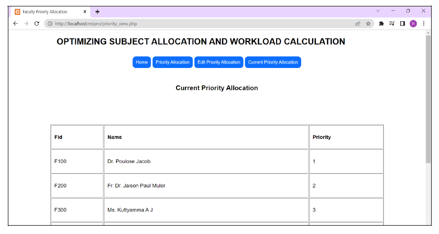  

Subject Allocation Iteration 1:
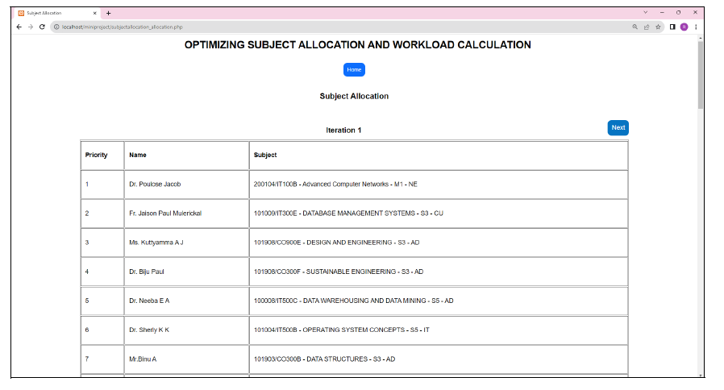  

Subject Allocation Iteration 2:
  

Subject Allocation Iteration 3:
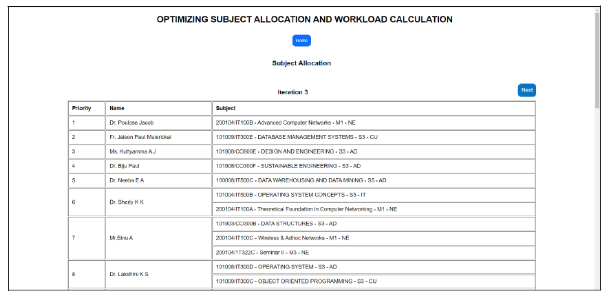  

Subject Allocation Iteration 4:
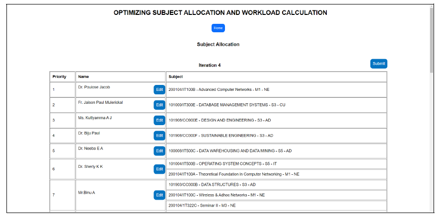  

Subject Allocation Output:
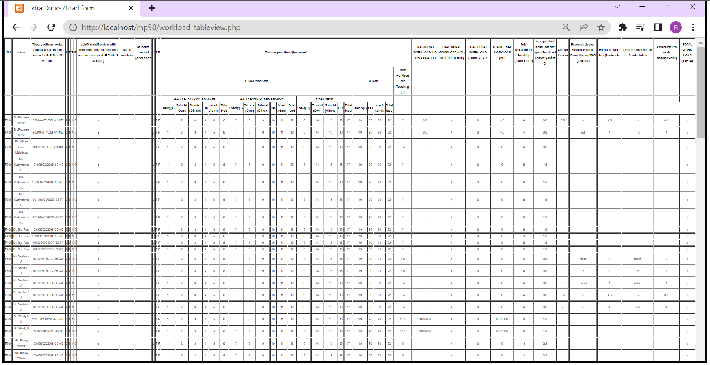  

---

##  Insights & Outcomes
- Reduced manual effort in subject allocation  
- Improved transparency and fairness in workload distribution  
- Enabled faster, data-driven academic planning  

---

##  Author
**Aneesh PB**  
 aneeshpb.tech@gmail.com  
 [LinkedIn](https://www.linkedin.com/in/aneesh-pb/)  

---

⭐ If you found this project helpful, consider giving it a star!
